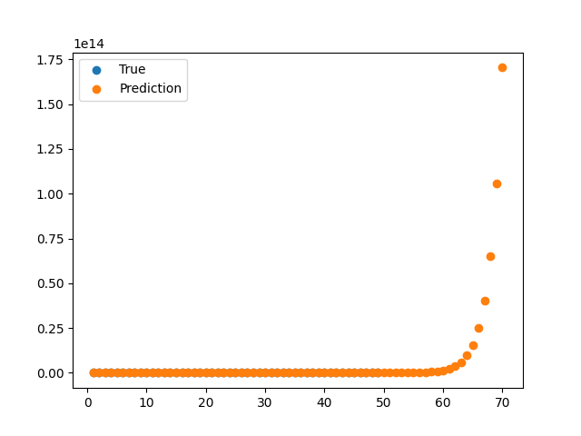

# AI is just large Function

인공 신경망은 사실 거대한 함수이다. 이 함수는 일반적인 함수보다는 특별하다. 그 이유를 묻는다면 바로 어떤 함수든 근사할 수 있기 때문이다. 사람이 말을 하는 과정, 사람이 사물을 보는 과정 또한 근사될 수 있다. 이러한 거대한 함수는 어떻게 모든 함수를 근사할 수 있을까? 우선 인공 신경망의 구조를 아주 간단하게 가정하고 바라보겠다. 

여기서 sigma는 activation function을 가르키는 말로 여기서는 간단하게 Step function을 사용하겠다. 여기서 w를 입력값에 곱해주는 것은 Step function의 폭을 조절하는 것이고 b를 더해주는 것은 양 옆으로 평행이동하는 것으로 볼 수 있다. 만약 1이라는 입력값에 대해서 2를 예측해야하는 상황이라면 학습을 통해서 w_1, w_2, b_1, b_2가 적절하게 조절되면서 아래와 같은 형태를 보일 수 있을 것이다. 

이러한 방식으로 입력값에 대한 출력값을 계속 조절하면, 이론적으로 노드의 개수가 셀 수 없이 많아지면 어떠한 함수라도 근사할 수 있게 된다. 단순히 노드의 개수를 늘리는 것은 상당한 비효율성을 불러일으킬 수 있기 때문에 실제로는 다층으로 노드를 쌓아서 효율적으로 함수를 근사하고 있다.

## 근사해보기

과연 실제로 모든 함수를 근사할 수 있을까?

### 2차 함수

### 3차 함수 

### 사인 함수 

### 피보나치 수열

피보나치 수열은 지수함수와 같은 형태를 보이기 때문에 scale이 너무 큰 문제가 있다. 이 문제를 해결하기 위해서 Log를 씌우면 Linear regression 문제가 되어 문제가 간단화된다. 이처럼 스케일이 너무 큰 함숫값은 normalization이 필요하다는 것을 다시금 깨달을 수 있었다. 